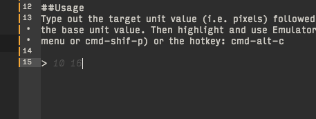

# EMulator (Atom Package)
*Important:* This package is very old, back from when when Atom was new. I'm not currently maintaining or updating it, and don't know if it works with the latest version of Atom.

Super simple (but very necessary) inline calculator for em(and rem) units.

## Installation
This package is in beta (I'll submit it to apm when it has error checkign and configuration). For now, to install, download or clone the package into your atom package directory:

```
~/.atom/packages/
```

##Usage
Type out the target unit value (i.e. pixels) followed by a space and then the base unit value. Then highlight and use Emulator > Calculate (from menu or cmd-shif-p) or the hotkey: cmd-alt-c

```10 16   //Converts to 0.625em```



## Todo
- Add error checking (for non numbers)
- Make rounding digits configurable
- Make hotkey configurable
- More robust calculations (probably as a separate package)
